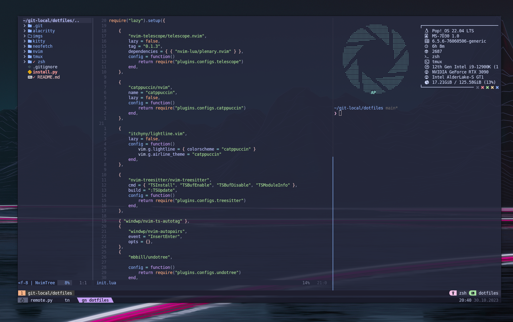

# My Dotfiles

<figure>
    
    <figcaption style="text-align: center;">NeoVim, tmux, Kitty</figcaption>
</figure>

## Dependencies

### General

- Font: [DejaVuSansMono Nerd Font](https://github.com/ryanoasis/nerd-fonts/releases/download/v3.0.2/DejaVuSansMono.zip)
- Neovim 0.9+ : [Link](https://neovim.io/)
- Tmux 3.2+ : [Link](https://github.com/tmux/tmux)
- Zsh 5.0+ : [Link](https://www.zsh.org/)
- Kitty : [Link](https://sw.kovidgoyal.net/kitty/) 


### Neovim 

- Node 20+ for `copilot/github.vim` and lsp related stuff: [Link](https://nodejs.org/en/download)
- ripgrep for `telecope` : [Link](https://github.com/BurntSushi/ripgrep)


### Tmux

- tmux plugin manager: [Link](https://github.com/tmux-plugins/tpm)

### Zsh

- neofetch: [Link](https://github.com/dylanaraps/neofetch)


## Quick Start

Clone this repository and run the `install.py` script.

```bash
git clone https://github.com/alberto-abarzua/dotfiles.git
cd dotfiles
python3 install.py
```
